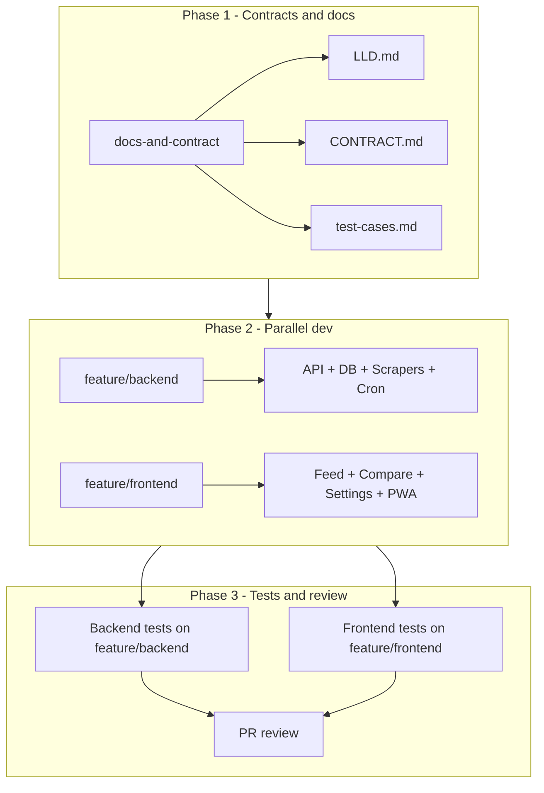

# Origin — Build and Delivery Plan

This plan covers documentation (LLD, API contracts, test cases), task breakdown for parallel agents in git worktrees, model assignments, PR review flow, and parallel testing. It assumes the existing [origin_arch_plan.md](.cursor/plans/origin_arch_plan.md) and [origin_prd.md](.cursor/plans/origin_prd.md) as given.

---

## 1. Documentation Deliverables

### 1.1 LLD (Low-Level Design)

**Location:** `docs/LLD.md` (or `.cursor/plans/origin_lld.md`).

**Contents:**

- **Database:** Full schema for `coffees` (and optional `roasters`): table names, column names, types, constraints, indexes. Reference Drizzle/Prisma-style definitions so backend implementers can generate migrations from it.
- **Scrapers:** Step-by-step flow for Shopify scraper (products.json fetch, pagination, variant selection, field mapping) and HTML scraper (Playwright flow, selectors strategy, per-product extraction, normalization). Error handling and retries (e.g. max retries, timeouts, log-and-continue).
- **API:** Exact behavior of `GET /coffees`: status codes, response shape (defer to API contracts doc), CORS policy, no query params in v1 (or document if any).
- **Jobs:** Daily scrape: cron expression (`0 6` * * *), timezone (Asia/Kolkata), entrypoint, what runs (read roasters config, run Shopify/HTML, upsert DB). Whether the process stays up for the API or exits after scrape.
- **Config:** Path to `roasters.json`, structure (name, url, type, optional collectionPath/productSelector for HTML). Backend env vars (e.g. `DATABASE_URL`, `PORT`).
- **Frontend:** Route structure (`/`, `/compare`, `/settings`), where localStorage is used (keys and shapes — can reference API contracts doc). No server-side session.

Create LLD **before** implementation so all agents share the same low-level spec.

---

### 1.2 API Contracts

**Location:** `docs/CONTRACT.md` (or `docs/api-contracts.md`). Single source of truth for backend–frontend contract.

**Contents:**

- **GET /coffees**
  - Method, path, no query params in v1.
  - Response: 200, body = JSON array of Coffee objects.
  - Coffee type: `id`, `name`, `roaster`, `roast_level`, `tasting_notes`, `description`, `price`, `weight`, `image_url`, `product_url`, `available` — with TypeScript types and nullability.
  - Roast level enum: `Light` | `Light-Medium` | `Medium` | `Medium-Dark` | `Dark` (exact strings).
  - Roaster list (for Settings/filters): Subko, Savorworks, Bloom Coffee Roasters, Rossette Coffee Lab, Marcs Coffee, Grey Soul Coffee — exact display names.
- **Frontend env:** `NEXT_PUBLIC_API_URL` — backend base URL.
- **localStorage:** Keys and value shapes:
  - `origin_compare`: array of coffee ids or full Coffee objects, max length 5.
  - `origin_roasters`: record of roaster name → boolean (enabled).
  - `origin_roast_preferences`: array of roast level strings.

Optional: add `shared/types.ts` (or `packages/types`) exporting Coffee and response types so backend and frontend import the same types.

---

### 1.3 Test Cases (Documentation)

**Location:** `docs/test-cases.md` (test plan / case list). Not the test code itself — the documented scenarios so implementers and reviewers know what must pass.

**Contents:**

- **Backend**
  - GET /coffees returns 200 and JSON array; structure matches Coffee type; only `available === true` included.
  - Shopify scraper: given a stub/mock products.json, output normalized Coffee list; cheapest variant selected; product_url format correct.
  - HTML scraper: given a stub HTML page, extracted fields match Coffee shape; one failing product does not stop the run.
  - Daily job: runs all roasters from config and upserts DB (can be tested with mocks).
- **Frontend**
  - Feed: loads coffees from API; filters by roast and roaster; Add to Compare (max 5); Buy opens product_url in new tab.
  - Compare: shows up to 5 coffees; remove works; empty state when none.
  - Settings: roaster toggles and roast preferences persist in localStorage; feed respects enabled roasters and preferences.
- **Integration**
  - Frontend can call GET /coffees and render feed (happy path).
  - Compare list survives refresh (localStorage).

Test **code** can be written in parallel (see Section 4); this doc is the checklist of what to cover.

---

## 2. Task Breakdown for Parallel Agents and Git Worktrees

Break work into **workstreams** that touch different directories to minimize merge conflicts. Each workstream = one branch, one git worktree, one agent (or sequential tasks in the same worktree).

### 2.1 Phase 1 — Foundation (single worktree, merge first)

| Task ID | Description                                                                                           | Branch                           | Owner          | Output                                                                                     |
| ------- | ----------------------------------------------------------------------------------------------------- | -------------------------------- | -------------- | ------------------------------------------------------------------------------------------ |
| T0      | Repo scaffold: monorepo root, `backend/`, `frontend/`, `docs/`, root package.json or workspace config | `main` or `chore/scaffold`       | You or Agent 1 | Folders and base configs                                                                   |
| T1      | LLD + API contracts + test cases doc                                                                  | `docs/contracts` or `chore/docs` | Agent 1        | `docs/LLD.md`, `docs/CONTRACT.md`, `docs/test-cases.md` (and optionally `shared/types.ts`) |

Merge T0 then T1 to `main` first. All later branches fork from `main` after T1 is merged.

### 2.2 Phase 2 — Backend and Frontend in parallel (two worktrees)

| Task ID | Description                                                            | Branch                                           | Worktree   | Owner   |
| ------- | ---------------------------------------------------------------------- | ------------------------------------------------ | ---------- | ------- |
| T2      | Backend: Drizzle schema, migrations, roasters.json, GET /coffees, CORS | `feature/backend-api`                            | worktree-1 | Agent A |
| T3      | Backend: Shopify scraper + daily job wiring (cron)                     | `feature/backend-shopify` (or same branch as T2) | worktree-1 | Agent A |
| T4      | Backend: HTML scraper (Playwright)                                     | `feature/backend-html` (or same branch)          | worktree-1 | Agent A |
| T5      | Frontend: Next.js scaffold, tabs, layout, env                          | `feature/frontend-scaffold`                      | worktree-2 | Agent B |
| T6      | Frontend: Feed (fetch, cards, filters, Compare add, Buy)               | `feature/frontend-feed` (or same as T5)          | worktree-2 | Agent B |
| T7      | Frontend: Compare page + Settings page                                 | `feature/frontend-compare-settings` (or same)    | worktree-2 | Agent B |
| T8      | Frontend: PWA (manifest, icons, service worker)                        | `feature/frontend-pwa` (or same)                 | worktree-2 | Agent B |

You can collapse T2–T4 into one branch `feature/backend` and T5–T8 into one branch `feature/frontend` so you have **two long-lived branches** and two worktrees. Each agent opens the repo in a worktree on their branch.

### 2.3 Phase 3 — Tests in parallel with dev

- **Backend worktree:** Add unit tests for GET /coffees, Shopify normalizer, HTML scraper (with mocked fetch/Playwright) in the same PR as the backend feature. Document in `docs/test-cases.md` that these cases are covered.
- **Frontend worktree:** Add component/integration tests for Feed, Compare, Settings (e.g. React Testing Library, mock API) in the same PR as the frontend feature. Optional: E2E (Playwright) against local backend in a follow-up PR.

So “testing in parallel” means: tests are implemented **alongside** backend and frontend in their respective worktrees and PRs, not in a separate phase. The **test cases doc** is written in Phase 1 so both agents know what to cover.

### 2.4 Git worktree setup (concrete)

- **Worktree 1 (backend):**  
`git worktree add ../Origin-backend feature/backend`  
Work in `../Origin-backend` for backend + backend tests; push and open PR when ready.
- **Worktree 2 (frontend):**  
`git worktree add ../Origin-frontend feature/frontend`  
Work in `../Origin-frontend` for frontend + frontend tests; push and open PR when ready.

Merge order: merge `feature/backend` first (so frontend can point at real API), then `feature/frontend`, or merge both after review and fix any integration issues on `main`.

---

## 3. Model Assignment and PR Review

### 3.1 Preselected model per task type

Use Cursor’s model selector per Composer/Agent session:

| Task type                            | Suggested model         | Rationale                                                   |
| ------------------------------------ | ----------------------- | ----------------------------------------------------------- |
| Docs (LLD, CONTRACT, test cases)     | More capable model      | Needs consistency and cross-referencing with PRD/arch plan. |
| Backend scaffold (T2), API route, DB | Faster model            | Boilerplate and well-defined contract.                      |
| Scrapers (T3, T4)                    | More capable model      | Parsing, resilience, and external site behavior.            |
| Frontend scaffold (T5), layout, tabs | Faster model            | Standard Next.js/React patterns.                            |
| Feed/Compare/Settings (T6, T7)       | More capable or default | UI logic and localStorage.                                  |
| PWA (T8)                             | Faster model            | Manifest and service worker are constrained.                |

“Faster model” = fast, cost-effective for narrow tasks. “More capable model” = default or higher tier for reasoning and scraping/UI.

### 3.2 PR review (1–2 models)

- **Option A — Single review model:** One Composer/Agent session with a **more capable model**; prompt: “Review this PR for correctness, contract compliance, and alignment with docs/LLD.md and docs/CONTRACT.md.”
- **Option B — Two reviewers:**  
  - Reviewer 1 (faster model): “Check PR for style, lint, and obvious bugs; ensure it follows project structure.”  
  - Reviewer 2 (more capable model): “Review for contract compliance, edge cases, and design doc alignment.”

Run review after the author opens the PR and before merge. Paste PR diff or link and the relevant doc snippets into the review agent(s).

---

## 4. Testing in Parallel — Summary

- **Phase 1:** Publish `docs/test-cases.md` so backend and frontend agents know what must pass.
- **Phase 2:**  
  - Backend agent: write backend unit/integration tests in the same worktree and PR as backend code.  
  - Frontend agent: write frontend tests (component + optional E2E) in the same worktree and PR as frontend code.
- No separate “test phase”; tests are part of each feature PR. Optionally add a **CI job** (e.g. GitHub Actions) that runs on every PR: install, lint, test, build backend and frontend.

---

## 5. What Else to Add to the Plan

- **CONTRIBUTING.md:** Short guide: how to create a worktree, which branch to branch from, PR naming (e.g. `feat/backend`, `feat/frontend`), and that PRs should reference the contract and test cases doc.
- **Branch naming:** e.g. `feat/backend`, `feat/frontend`, `chore/docs`, `fix/...` so CI and reviewers can infer scope.
- **CI on PRs:** Run lint, test, and build for the changed area (backend and/or frontend). Block merge if tests fail.
- **Changelog or release checklist:** A simple `CHANGELOG.md` or “Release checklist” in the plan so you can tick off success criteria before calling v1 done.
- **Contract versioning:** If you later add GET /coffees?roaster= or new endpoints, note in CONTRACT.md that v1 has no query params and add a short “Contract version” or “Last updated” line.
- **Single “contract + LLD” PR:** Merge LLD, CONTRACT, and test cases in one PR so there is a single baseline for all feature branches.

---

## 6. Suggested Order of Operations

1. Create repo scaffold and `docs/` (T0).
2. Create LLD, CONTRACT, and test-cases doc in one branch; merge to `main` (T1).
3. Create two worktrees: `feature/backend`, `feature/frontend`.
4. Run backend tasks (T2–T4) in worktree-1; frontend tasks (T5–T8) in worktree-2. Include tests in the same PRs.
5. Open PRs; run 1–2 review agents; merge backend first, then frontend.
6. Fix any integration issues on `main`; run full test suite and confirm success criteria.

This keeps documentation and contracts first, allows parallel agents in isolated worktrees, assigns models by task type, uses 1–2 models for PR review, and keeps testing in parallel with development.