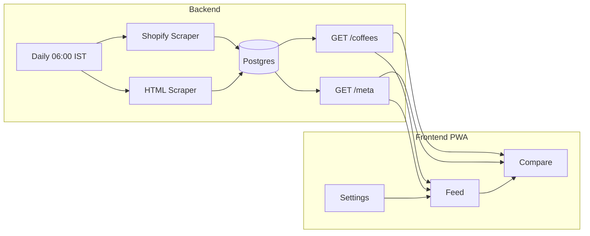

# Origin Coffee Aggregator — Implementation Plan

## Architecture Overview




- **Backend**: Standalone Node.js (TypeScript) service: scrapers, PostgreSQL DB, REST API, freshness metadata endpoint, in-process cron at 06:00 IST.
- **Frontend**: Next.js (App Router), React, TailwindCSS, PWA (manifest + service worker).
- **No auth**: Compare state and settings in `localStorage`; no user accounts.

---

## 1. Repository and Backend Setup

**Structure (monorepo):**

```
Origin/
├── backend/           # Node.js + TypeScript
│   ├── src/
│   │   ├── scrapers/
│   │   ├── db/
│   │   ├── api/
│   │   └── jobs/
│   ├── config/
│   │   └── roasters.json
│   └── package.json
├── frontend/          # Next.js PWA
│   ├── app/
│   ├── components/
│   └── package.json
└── package.json       # optional root workspace
```

**Backend stack:**

- **Runtime**: Node.js + TypeScript.
- **DB**: PostgreSQL with **Drizzle ORM** and checked-in SQL migrations so beta/prod storage is managed and repeatable.
- **HTTP**: Fastify or Express — `GET /coffees` only for v1.
- **Scheduler**: **node-cron** inside the process — schedule `0 6 `* * * with TZ=Asia/Kolkata (06:00 IST).
- **Scraping**: `fetch` for Shopify; **Playwright** (Node) for HTML scrapers.

**Roaster config:** `[backend/config/roasters.json](backend/config/roasters.json)` — structure as in spec (`name`, `url`, `type`: `"shopify"` | `"html"`). Backend reads this at startup and for the daily job.

---

## 2. Data Model and Database

**Coffee table (align with spec):**


| Column        | Type    | Notes                                        |
| ------------- | ------- | -------------------------------------------- |
| id            | PK      | UUID or integer                              |
| name          | string  |                                              |
| roaster       | string  | From config                                  |
| roast_level   | string  | Light                                        |
| tasting_notes | string  | Comma-separated or JSON; display as provided |
| description   | string  | Origin/process/varietal combined             |
| price         | number  | Cheapest variant (Shopify)                   |
| weight        | string  | e.g. "200g"                                  |
| image_url     | string  |                                              |
| product_url   | string  | Full URL to roaster product page             |
| available     | boolean | Default true                                 |
| roaster_id    | string  | FK to roaster config / name for filtering    |


**Roaster table (optional):** Store `name`, `url`, `type`, `enabled` (boolean). If omitted for v1, "enabled" can live only in frontend settings and backend always scrapes all from config; API can filter by a query param later. Recommendation: single `coffees` table with `roaster` name; roaster list for "enable/disable" comes from config + frontend persistence.

**Migrations:** One initial migration creating `coffees` (and optionally `roasters`). On each scrape run: truncate or upsert by `(roaster, product_url)` to avoid duplicates and reflect availability.

---

## 3. Scrapers

### 3.1 Shopify Scraper

- **Input**: Roaster config entry with `type: "shopify"` and `url` (base site URL).
- **Steps**:
  1. `GET {baseUrl}/products.json` (handle pagination if present — `?page=2` etc.).
  2. For each product, take the **cheapest variant** (by price); if multiple variants (e.g. 200g / 500g), pick one consistently (e.g. smallest pack or first).
  3. Map to Coffee:
    - `name` ← product title
    - `price` ← selected variant price
    - `weight` ← variant title or option (e.g. "200g") if available, else from product body/title
    - `product_url` ← `{baseUrl}/products/{product.handle}`
    - `image_url` ← first product image or variant image
    - `roast_level` ← from tags, product type, or title (keyword match: "Light", "Dark", "Medium", etc.); else `null`
    - `tasting_notes` ← from tags or description (parse or leave as string)
    - `description` ← product body or combined origin/process/varietal if structured
    - `roaster` ← config name; `available` ← true
- **Output**: List of Coffee objects; write to DB (upsert by roaster + product_url).

### 3.2 HTML Scraper (Playwright)

- **Input**: Roaster config entry with `type: "html"` and `url`.
- **Steps**:
  1. Launch Playwright (headless); open roaster's coffee collection page (often `url` or `url/collections/coffee` — may need per-roaster URL in config).
  2. Extract product links from the listing.
  3. For each link, visit product page and scrape: name, price, image, description, and optionally roast level / tasting notes from text or structure.
  4. Normalize into same Coffee shape; set `product_url` to the visited page.
  5. Persist to DB.
- **Config**: Extend roasters.json with optional `collectionPath` or `productSelector` per roaster if needed for robustness (can add later).
- **Resilience**: Timeouts, retries, and try/catch per product so one failure doesn't kill the whole run; log and continue.

**Shared:** A single "scrape all" job that reads `roasters.json`, runs the appropriate scraper per roaster, and then runs DB upsert. Run this job from the cron at 06:00 IST.

---

## 4. API

- **GET /coffees**
  - Returns all coffees where `available = true` (and optionally filter by roaster if backend supports it for future use).
  - Response body: JSON array of objects with: `name`, `roaster`, `roast_level`, `tasting_notes`, `description`, `price`, `weight`, `image_url`, `product_url` (and optionally `available`). Frontend only needs these fields.
- **CORS**: Allow frontend origin (e.g. `http://localhost:3000` in dev and production PWA origin).
- **No auth** in v1.

---

## 5. Frontend (Next.js PWA)

### 5.1 Stack and PWA

- **Next.js 14+** (App Router), **React 18**, **TailwindCSS**.
- **PWA**: `next-pwa` or manual setup — `manifest.json` (name, short_name, start_url, display: standalone), icons, and a service worker for offline caching of static assets and API response for feed (optional: cache GET /coffees for short TTL).

### 5.2 Navigation and Layout

- **Tabs**: Feed | Compare | Settings (bottom nav on mobile, or top).
- **Route structure**: `/` (Feed), `/compare` (Compare), `/settings` (Settings).
- **Data fetching**: Fetch `GET /coffees` on Feed (and Compare) via `fetch` or SWR/React Query; pass API base URL via env (e.g. `NEXT_PUBLIC_API_URL`).

### 5.3 Feed Page

- **List**: Coffee cards (grid or list). Each card shows: image, name, brand (roaster), roast level, tasting notes, price, and actions: **Save** (optional bookmark in localStorage), **Compare** (add to compare list, max 5), **Buy** (open `product_url` in new tab).
- **Filters**: Two dropdowns or chips — **Roast level** (Light, Light-Medium, Medium, Medium-Dark, Dark) and **Roaster** (from unique roasters in data or from config). Filter client-side from the full coffees array (or support query params and filter on backend later).
- **Roast preferences**: If user has set preferred roast levels in Settings, default the roast filter to those (or sort/prioritize by preference). Stored in localStorage.

### 5.4 Compare Page

- **State**: Compare list (array of up to 5 coffee IDs or full objects) in **localStorage** (e.g. `origin_compare`).
- **UI**: Table with columns: Coffee Name, Brand, Roast Level, Tasting Notes, Description, Price, Buy button. One row per coffee. Allow "Remove from compare" and link back to Feed to add more.
- **Empty state**: "Add coffees from the Feed to compare."

### 5.5 Settings Page

- **Roasters**: List from backend config or from a small static list matching spec (Subko, Savorworks, Bloom Coffee Roasters, Rossette Coffee Lab, Marcs Coffee, Grey Soul Coffee). Each row: name + toggle **Enabled**. Persist in localStorage (e.g. `origin_roasters` — object mapping roaster name to boolean). Feed (and API later) can filter by enabled roasters.
- **Roast preferences**: Checkboxes or multi-select for "Preferred roast levels" (same five options). Persist in localStorage (e.g. `origin_roast_preferences`). Use on Feed to pre-fill or weight the roast filter.

No auth; no server-side user store.

---

## 6. Implementation Order

1. **Backend scaffold**: Node + TS, Drizzle + SQLite, Coffee schema, migrations, `roasters.json` with the six roasters (types: Shopify vs HTML as per spec).
2. **Shopify scraper**: Fetch products.json, normalize to Coffee, pick cheapest variant, upsert DB. Test with one roaster (e.g. Subko).
3. **GET /coffees**: Fastify/Express route, return JSON; CORS.
4. **HTML scraper**: Playwright script for one HTML roaster (e.g. Savorworks); then add Marcs; normalize and upsert.
5. **Cron**: node-cron in same process, 06:00 IST, run full scrape (all roasters) then exit or keep process up for API.
6. **Frontend scaffold**: Next.js, tabs (Feed, Compare, Settings), env for API URL.
7. **Feed**: Fetch coffees, card component, filters (roast, roaster), Compare add (localStorage), Buy link.
8. **Compare**: Read from localStorage, table view, remove, Buy.
9. **Settings**: Roaster toggles and roast preferences, localStorage; wire Feed to use preferences and enabled roasters.
10. **PWA**: Manifest, icons, service worker; test "Add to Home Screen" and offline behavior.

---

## 7. Key Files to Create


| Area     | File                                | Purpose                                               |
| -------- | ----------------------------------- | ----------------------------------------------------- |
| Backend  | `backend/config/roasters.json`      | Roaster list and types                                |
| Backend  | `backend/src/db/schema.ts`          | Drizzle Coffee (and optional Roaster) schema          |
| Backend  | `backend/src/scrapers/shopify.ts`   | Shopify products.json scraper                         |
| Backend  | `backend/src/scrapers/html.ts`      | Playwright HTML scraper                               |
| Backend  | `backend/src/jobs/dailyScrape.ts`   | Invoked by cron; runs both scrapers, upserts DB       |
| Backend  | `backend/src/api/routes/coffees.ts` | GET /coffees                                          |
| Frontend | `frontend/app/page.tsx`             | Feed                                                  |
| Frontend | `frontend/app/compare/page.tsx`     | Compare                                               |
| Frontend | `frontend/app/settings/page.tsx`    | Settings                                              |
| Frontend | `frontend/app/layout.tsx`           | Tab nav + provider if any                             |
| Frontend | `frontend/public/manifest.json`     | PWA manifest                                          |
| Frontend | `frontend/lib/storage.ts`           | localStorage helpers (compare, roasters, roast prefs) |


---

## 8. Risks and Notes

- **Roast level / tasting notes**: Shopify and HTML sites often don't expose structured fields. Plan to infer from tags, product type, or description text; some roasters may show "—" or "N/A" until site-specific parsing is added.
- **HTML scraper fragility**: Selectors may break when roasters change their site. Keep selectors in one place (or in config) and add per-roaster overrides if needed.
- **CORS**: In production, set `NEXT_PUBLIC_API_URL` to the deployed backend; ensure backend allows that origin.
- **Rate limiting**: Be polite: add small delays between requests in HTML scraper; Shopify's products.json is a single request per site (plus pagination).

---

## 9. Success Criteria Checklist

- Users can **view** all coffees from the six roasters in one feed.
- Users can **filter** by roast level and roaster.
- Users can **add up to 5 coffees** to compare and view them in a comparison table.
- **Buy** opens the roaster product page in a new tab.
- **Settings**: Enable/disable roasters; set roast preferences; both persist and affect feed.
- **Backend**: Daily scrape at 06:00 IST; GET /coffees returns normalized data; no checkout or user accounts.

